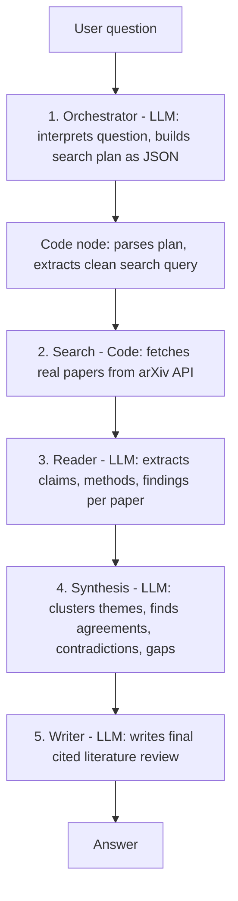

# ScholarMind — Multi-Agent Academic Research Assistant

ScholarMind is a multi-agent academic research assistant built on the [Dify](https://dify.ai) platform. Given a research question, five cooperating agents plan a search strategy, retrieve real papers from arXiv, analyze them, synthesize findings across the literature, and produce a cited mini literature review.

This project was developed as a final project for an NLP course. It demonstrates a collaborative multi-agent pipeline with a clear division of labor, real external tool use, and grounded, citation-backed output.

## What it does

Ask a question like *"What are recent advances in graph neural networks for drug discovery?"* and ScholarMind returns a structured literature review with an introduction, thematic discussion, points of agreement and contradiction across papers, identified research gaps, and a reference list with arXiv IDs, all grounded in papers retrieved live from arXiv.

## Architecture

The system is implemented as a Dify Chatflow composed of five cooperating agents plus supporting logic nodes:



Each agent has a single, well-defined responsibility and passes its structured output to the next, so the agents genuinely cooperate on one task rather than acting independently.

| Agent | Type | Responsibility |
|-------|------|----------------|
| 1. Orchestrator | LLM | Interprets the question and produces a search plan as JSON |
| Code node | Code | Parses the plan and extracts a clean search query |
| 2. Search | Code | Fetches real papers from the arXiv API |
| 3. Reader | LLM | Extracts key claims, methods, and findings per paper |
| 4. Synthesis | LLM | Clusters findings into themes; surfaces agreements, contradictions, gaps |
| 5. Writer | LLM | Writes the final cited literature review |

## Key design decisions

- **Live retrieval over a static corpus.** The Search agent queries the arXiv API at request time, so reviews are grounded in real, current papers rather than a fixed dataset.
- **In-platform retrieval for reliability.** The arXiv fetch runs inside a Dify Code node, which keeps the retrieval path self-contained and avoids external networking fragility, important for reproducible demos.
- **Grounded citation discipline.** The Writer agent is instructed to cite only papers present in the synthesis, using their arXiv IDs, to reduce fabricated references.
- **Honest scope.** The synthesis explicitly reports contradictions and gaps rather than overstating consensus.

## Tech stack

- **Orchestration:** Dify (Chatflow, self-hosted via Docker)
- **LLM:** DeepSeek (deepseek-chat) for all five agents
- **Retrieval:** arXiv API
- **Custom tooling:** a FastAPI service (tools/) providing paper search and a hand-written keyphrase-extraction endpoint

## Repository structure

```
.
├── dify-export/     Dify DSL export (ScholarMind.yml) - import to recreate the full app
├── tools/           FastAPI tool service (app.py, requirements, Dockerfile)
├── report/          Written project report
├── ppt/             Presentation slides
├── screenshots/     Screenshots of the working pipeline
└── docs/            Additional notes and documentation
```

## Recreating the system

The entire multi-agent app is captured in the Dify DSL export. To recreate it:

1. Install and run [Dify](https://docs.dify.ai/getting-started/install-self-hosted).
2. Configure a DeepSeek API key under Settings then Model Provider.
3. In Dify Studio, choose Import DSL and select dify-export/ScholarMind.yml.
4. Publish the app and start a conversation.

## Limitations and future work

- Retrieval is currently limited to arXiv; adding other sources (Semantic Scholar, PubMed) would broaden coverage.
- A vector knowledge base could be reintroduced to support retrieval over a persistent corpus in addition to live search.
- Models can be over-confident on out-of-domain claims; adding a verification agent is a natural next step.

## Author

Muhammad Usman Kazim — Yunnan University

## Acknowledgements

Built on the open-source Dify platform, using the arXiv API for paper retrieval and DeepSeek for language model inference.
